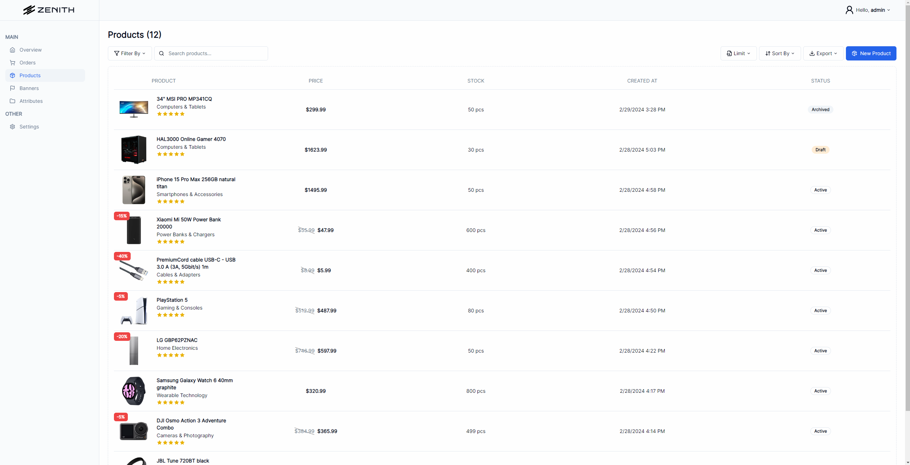
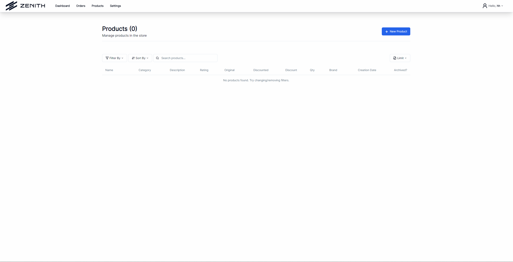
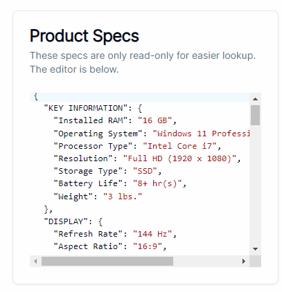
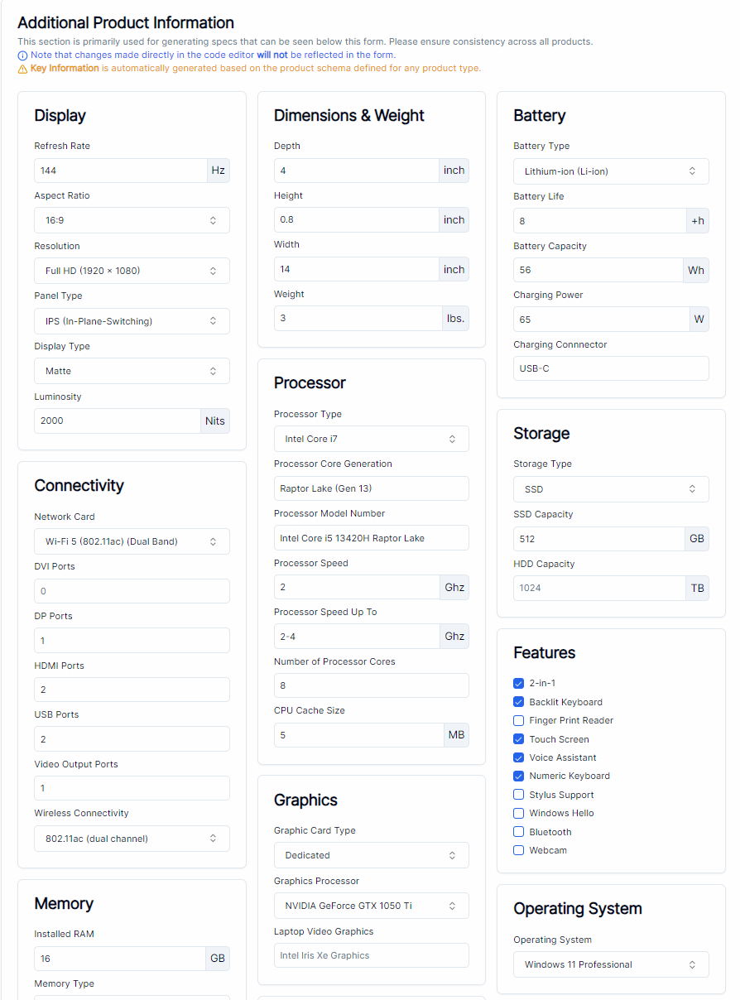
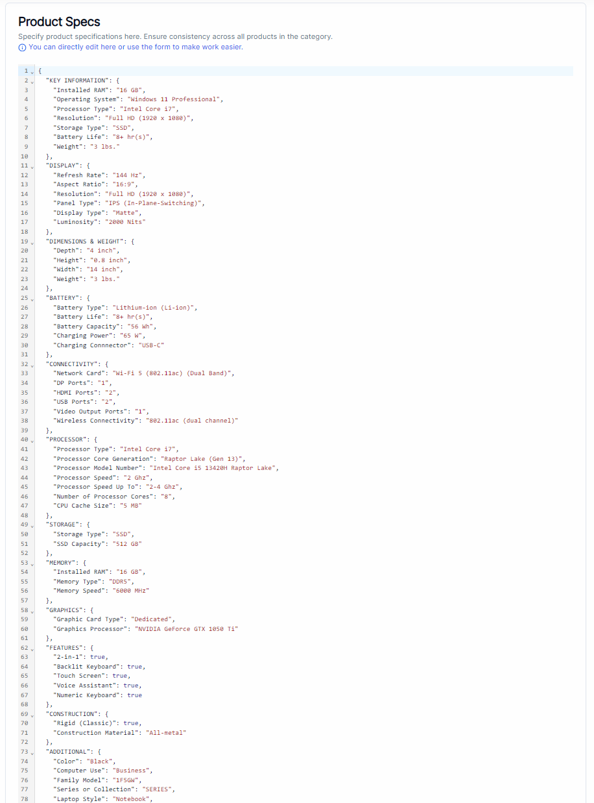
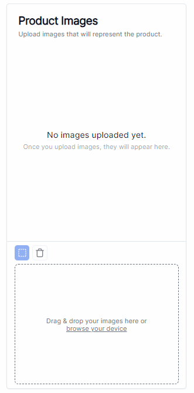
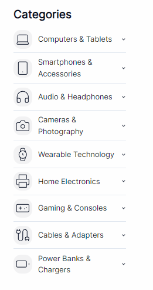

# ZENITH ECOMMERCE PLATFORM

## Description

Fully functional ecommerce platform, with all features

Please note that while the ecommerce platform is not yet available for users entirely, significant progress is being made on the admin interface. The admin interface boasts a plethora of advanced functionalities including seamless product creation, sophisticated product editing, comprehensive product viewing, and more.

## Currently working on

Adding more schemas for specs generation, starting work on banner manager and attribute manager

## Features

- Responsive & minimalistic design
- Offering powerful administrator interface
- Dark/light mode
- More features to come...

## Images Of Progress Made

## License

[MIT](https://github.com/ZunwDev/ZENITH-PLATFORM/blob/master/LICENSE)

## Resources

### Main technologies/frameworks/libraries used

- [React](https://react.dev/)
- [Spring Boot](https://spring.io/projects/spring-boot)
- [Shadcn](https://ui.shadcn.com/docs)
- [Firebase](https://firebase.google.com/)
- [Lucide React Icons](https://lucide.dev/icons/)
- [TailwindCSS](https://tailwindcss.com/docs/installation)
